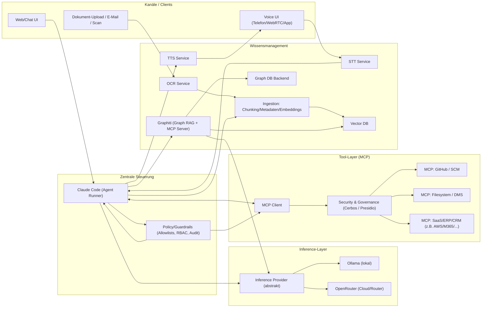

# Grundarchitektur einer universellen AI-Automatisierungslösung für KMU

## Executive Summary

Diese Referenzarchitektur beschreibt eine **modular aufgebaute Automatisierungsplattform für KMU**, deren Kern ein agentischer Orchestrator (zentrale Steuerung) ist, der **(a) LLM-Inferenz** über einen flexibel austauschbaren Provider (Ollama lokal oder OpenRouter als Router/Cloud-Gateway), **(b) Tools/Integrationen** über das **Model Context Protocol (MCP)** sowie **(c) Wissensmanagement** über **Vector-RAG (Vektordatenbank)** und **Graph-RAG (Graphiti)** kombiniert. MCP ist als standardisierte „Tool-Schnittstelle“ entstanden, um AI-Clients sicher und strukturiert mit externen Systemen zu verbinden. 

Wesentliche Ergebnisse aus der GitHub-/Doku-Recherche:

- **Inference-Layer:**  
  - **Ollama** ist ein stark KMU-tauglicher Default für On‑Prem, u. a. weil es **Anthropic‑Messages‑API‑Kompatibilität** bereitstellt (wichtig, um Tools wie Claude Code gegen lokale Modelle zu betreiben). 
  - **OpenRouter** ist als Provider-/Routing-Layer attraktiv (Fallbacks, ein Endpoint für viele Modelle), aber bei Nutzung mit Claude Code ist laut Doku **Kompatibilität nur für Anthropic “First‑Party” zuverlässig garantiert** (Provider-Priorisierung nötig). 
  - **LiteLLM** ist als optionaler „AI‑Gateway/Proxy“ sinnvoll, wenn KMU **Routing, Key‑Management, Observability** oder **einheitliche OpenAI-/Anthropic‑Kompatibilität** für mehrere Backends benötigen; Lizenz ist überwiegend MIT, aber mit separatem Enterprise‑Bereich. 

- **Zentrale Steuerung:**  
  - **Claude Code** ist funktional der naheliegende zentrale Agent‑Runner, ist aber **nicht Open Source** („All rights reserved“ unter Anthropic Terms) – das ist für Lizenz-/Compliance‑Anforderungen vieler KMU ein maßgeblicher Architekturtreiber. 
  - Für „OSS‑First“-KMU sind **OpenHands** und **OpenCode** ernstzunehmende Alternativen als agentische Runner (beide MIT, bei OpenHands mit Enterprise‑Ausnahme). 

- **Graph-RAG (Graphiti):**  
  - Graphiti bietet eine temporale Knowledge‑Graph‑Memory‑Schicht und bringt **einen MCP‑Server** mit (direkt in Claude‑Tooling integrierbar).  
  - Backend-Wahl ist entscheidend: **Neo4j** (primär, aber GPLv3), **FalkorDB** (Default‑Container‑Setup, aber SSPL‑Lizenz), oder **Amazon Neptune** (managed, enterprise‑Security‑Features; für Hybrid/Cloud attraktiv).   
  - Kuzu ist **archiviert** und fällt bei „aktive Wartung“ klar zurück. 

- **Tools/Plugins via MCP:**  
  - Es gibt „offizielle“/nahezu produktionsnahe MCP‑Server (z. B. **GitHub Official MCP Server**, **AWS MCP Servers**), aber auch Referenzserver, die explizit als **nicht production‑ready** eingeordnet werden – für KMU muss man hier eine klare „Prod‑Whitelist“ definieren. 

- **Voice/OCR:**  
  - Für Voice‑Agenten sind **LiveKit Agents** (Apache‑2.0, mit Produktions-/Deployment-Fokus), **Vocode** (MIT) und **Wyoming** (MIT, Home‑Assistant‑Ökosystem) die stabilsten Open‑Stacks.   
  - Für OCR sind **Tesseract**, **PaddleOCR** und **docTR** robuste OSS‑Baselines; bei PaddleOCR sollte man Abhängigkeits-/Lizenzrisiken im Packaging prüfen. 

## Grundarchitektur

### Architekturprinzipien

Die Grundarchitektur trennt strikt zwischen:

- **Control Plane (Agentik/Orchestrierung):** zentraler Runner (z. B. Claude Code) steuert Aufgaben, Policies, Tool-Aufrufe und Audit.  
- **Data Plane (Wissen/Automatisierung):**  
  - **Tool‑Zugriffe** über MCP (CRM/ERP, GitHub, Files, DBs)  
  - **Wissensspeicher**: Vector‑Store (semantische Suche) + Graph‑Store (Beziehungen/Temporalität über Graphiti)  
  - **Multimodal-Ingestion**: OCR + Voice (STT) → Text/Struktur → Indexierung in Vector/Graph  
- **Inference Plane:** austauschbarer Provider: lokal (Ollama) oder Router/Cloud (OpenRouter). Ollama kann sich dabei als Anthropic‑kompatibler Endpoint präsentieren (wichtig für Claude‑Tooling). 

### Gesamtarchitekturdiagramm (Mermaid)

## Komponentenempfehlungen

### Bewertungslogik (Scores 1–5)

- **Stabilität:** Reifegrad, Release/Change‑Signale, „archived“/breaking changes, Produktionshinweise in Doku.  
- **Wartbarkeit:** Dokumentation, klare Schnittstellen, Community/Issues, Modularität.  
- **KMU‑Eignung:** Ressourcenbedarf, Deployment‑Komplexität, Betriebs-/Security‑Footprint, Self‑Hosting‑Ergonomie.  
- **Lizenz:**  
  - **5** = klar permissiv (MIT/Apache/BSD)  
  - **4** = permissiv, aber Caveats (z. B. Dual‑Bereiche/Enterprise‑Ordner)  
  - **3** = Copyleft (GPL/AGPL) – intern oft ok, SaaS/Distribution heikel  
  - **2** = SSPL/ähnlich restriktiv (SaaS‑Einschränkungen)  
  - **1** = proprietär/Terms‑gebunden („All rights reserved“)

> Hinweis: Scores sind eine **praxisorientierte KMU-Einschätzung**, keine formale Auditierung. „nicht spezifiziert“ wird verwendet, wenn etwas in den Primärquellen nicht eindeutig dokumentiert ist.

### Inference‑Provider

Kurzbeschreibung: Der Inference‑Layer stellt Chat/Tool‑Calling‑Inferenz bereit. Für die hier geforderte Architektur ist besonders wichtig, dass **Claude‑Tooling/Agentik** entweder (a) gegen einen **Anthropic‑kompatiblen Endpoint** läuft oder (b) über einen Router/Proxy die Provider‑Details abstrahiert. Ollama dokumentiert explizit Anthropic‑Kompatibilität für Tools wie Claude Code. 

| Option | GitHub | Stability | Wartbarkeit | KMU‑Eignung | Lizenz |
|---|---:|---:|---:|---:|---:|
| Ollama (lokal) | `https://github.com/ollama/ollama` | 4 | 4 | 5 | 5 |
| OpenRouter (Service) + offizielles SDK | `https://github.com/OpenRouterTeam/python-sdk` | 4 | 4 | 4 | 5 |
| LiteLLM (Gateway/Proxy) | `https://github.com/BerriAI/litellm` | 4 | 3 | 4 | 4 |

Repo-/Lizenzbasis: Ollama ist MIT‑lizenziert; OpenRouter SDKs sind Apache‑2.0; LiteLLM ist außerhalb des Enterprise‑Ordners MIT, Enterprise‑Code separat lizenziert. 

**Hauptvorteile/Nachteile & Integrationshinweise**

- **Ollama**  
  Vorteile: Volle Datenhoheit (On‑Prem), gutes KMU‑Kostenprofil nach initialer Hardware, Anthropic‑Messages‑API‑Kompatibilität vereinfacht Integration mit Claude‑Tooling.   
  Nachteile: Modellgüte hängt von lokal verfügbaren Open‑Weight‑Modellen ab; GPU‑Dimensionierung ist KMU‑kritisch (je nach Modell/Kontext). „nicht spezifiziert“: SLA/Supportmodell für rein lokale Nutzung.

  Integration:  
  - **Claude Code ↔ Ollama** über Anthropic‑kompatible API; Ollama dokumentiert explizit diese Nutzung für Claude Code.   
  - **Graphiti ↔ Ollama**: Graphiti unterstützt lokale Modelle via Ollama (LLM‑Config). 

- **OpenRouter (Service) + offizielles SDK**  
  Vorteile: Ein API‑Endpoint für viele Modelle, Provider‑Wechsel ohne Code‑Änderungen, offizielle SDKs (Python/TS) mit Apache‑2.0‑Lizenz.   
  Nachteile: Cloud‑Abhängigkeit; bei Claude Code gilt: **Kompatibilität ist nur mit Anthropic‑First‑Party‑Provider zuverlässig garantiert** (Provider‑Priorisierung nötig). 

  Integration:  
  - **Claude Code ↔ OpenRouter** gemäß OpenRouter‑Guide; Provider‑Prioritäten setzen (Anthropic 1P oben).   
  - Für KMU‑Security: API‑Keys zentral verwalten (Vault/Secret‑Manager) und Ausleitung sensibler Daten per Policy verhindern (siehe Security‑Kapitel).

- **LiteLLM (Gateway/Proxy)**  
  Vorteile: Einheitliche Provider‑Abstraktion; offizielle Doku nennt direkte OpenRouter‑Unterstützung; hilfreich als „KMU‑AI‑Gateway“ (z. B. Routing, Logging, Kostenkontrolle).   
  Nachteile: Zusätzliche Komponente erhöht Betriebsaufwand; Lizenz ist überwiegend MIT, aber Enterprise‑Teil separat – für „strict OSS“ muss man Feature‑Boundary sauber ziehen.   
  Integration: Als Zwischenlayer zwischen Claude‑/Agent‑Clients (oder eigenen Services) und Ollama/OpenRouter; besonders sinnvoll bei Hybrid‑Setups (lokal + Cloud).

### Zentrale Steuerung

Kurzbeschreibung: Die zentrale Steuerung übernimmt Task‑Planung, Tool‑Calling, Ausführung (Shell/Workflows), sowie Kontext-/Policy‑Durchsetzung. Claude Code wird als agentisches Terminal‑Tool beschrieben, das Codebase versteht und Workflows automatisiert. 

| Option | GitHub | Stability | Wartbarkeit | KMU‑Eignung | Lizenz |
|---|---:|---:|---:|---:|---:|
| Claude Code (primär) | `https://github.com/anthropics/claude-code` | 4 | 4 | 4 | 1 |
| OpenHands (OSS‑Agent‑Plattform) | `https://github.com/OpenHands/OpenHands` | 4 | 3 | 3 | 4 |
| Aider (Terminal‑Agent) | `https://github.com/Aider-AI/aider` | 4 | 4 | 3 | 5 |

Repo-/Lizenzbasis: Claude Code „All rights reserved“ unter Anthropic Commercial Terms; OpenHands MIT außerhalb enterprise/; Aider Apache‑2.0. 

**Hauptvorteile/Nachteile & Integrationshinweise**

- **Claude Code**  
  Vorteile: MCP‑Ökosystem, agentische Terminal‑Integration; Doku betont Third‑Party‑Provider‑Support in Terminal/VS Code (für Ollama/OpenRouter relevant).   
  Nachteile: **Lizenz-/Nutzungsbedingungen** statt OSS‑Lizenz; für manche KMU (öffentliche Auftraggeber, streng regulierte Branchen) ist das ein No‑Go oder erfordert Rechtsprüfung.   
  Integration: Als „Control Plane“; Tools über MCP; Inference über Anthropic‑API‑Kompatibilität (Ollama) oder OpenRouter‑Integration.

- **OpenHands**  
  Vorteile: OSS‑Agent‑Plattform, MIT‑Kern (mit Enterprise‑Ausnahme); geeignet, wenn KMU eine „Agent‑Runtime als Service“ statt CLI‑Fokus wollen.   
  Nachteile: Höherer Betriebsaufwand als reine CLI; „KMU‑Eignung“ hängt stark davon ab, ob man eine dauerhafte Agent‑Runtime betreiben möchte (nicht spezifiziert: Minimal‑Footprint im Small‑Setup).

- **Aider**  
  Vorteile: Reifes Terminal‑Agent‑Konzept, permissive Apache‑2.0; gut als „operativer Helfer“ (Repo‑Änderungen, Skript‑Tasks) neben/unter Claude Code.   
  Nachteile: Primär coding‑zentriert; für „Business‑Automatisierung“ braucht es ergänzende Connector-/Tool‑Schicht (MCP oder eigene Integrationen).

### Werkzeuge über spezialisierte Claude‑Plugins (MCP‑Server)

Kurzbeschreibung: MCP ist ein offener Standard, um AI‑Clients mit Tools/Datenquellen zu verbinden. Anthropic beschreibt MCP als Standard für sichere, bidirektionale Verbindungen; GitHub und AWS liefern konkrete MCP‑Server. 

| Option | GitHub | Stability | Wartbarkeit | KMU‑Eignung | Lizenz |
|---|---:|---:|---:|---:|---:|
| GitHub Official MCP Server | `https://github.com/github/github-mcp-server` | 4 | 4 | 4 | 5 |
| AWS MCP Servers (awslabs/mcp) | `https://github.com/awslabs/mcp` | 4 | 4 | 3 | 5 |
| modelcontextprotocol/servers (Referenzserver) | `https://github.com/modelcontextprotocol/servers` | 3 | 3 | 2 | 5 |

Repo-/Lizenzbasis: GitHub MCP Server ist als offizieller MCP Server dokumentiert; GitHub‑Docs erläutern Zugriffsanforderungen. AWS MCP zeigt aktive Releases. modelcontextprotocol/servers wird explizit als Referenz-/Beispielcode (nicht production‑ready) positioniert. 

**Hauptvorteile/Nachteile & Integrationshinweise**

- **GitHub Official MCP Server**  
  Vorteile: Offizieller Server mit breiter GitHub‑API‑Abdeckung; GitHub‑Doku nennt konkrete Tool‑Use‑Cases (Repos/Issues/PRs).   
  Nachteile: „Requires Secrets“ (PAT) und damit striktes Secret‑Handling, Least‑Privilege‑Scopes, Audit‑Logging.   
  Integration: Als MCP‑Toolserver an Claude Code anbinden; in KMU‑Architektur: nur in DevOps‑Tenant/Workspace aktivieren.

- **awslabs/mcp**  
  Vorteile: Offizielle AWS‑MCP‑Server‑Sammlung mit aktiver Release‑Frequenz.   
  Nachteile: Für viele KMU „zu schwer“, wenn AWS nicht Kernplattform ist; IAM‑Komplexität und Sicherheitskonfiguration sind nicht trivial (nicht spezifiziert: Minimal‑IAM‑Policy‑Sets je Server).

- **modelcontextprotocol/servers (Referenz)**  
  Vorteile: Viele Beispiele, schnelles Prototyping, gutes Lernmaterial.   
  Nachteile: Doku warnt explizit: **nicht production‑ready**, Security‑Safeguards müssen selbst gebaut werden.   
  Integration: Nur als Ausgangsbasis; produktive KMU‑Stacks sollten daraus „gehärtete“ interne MCP‑Server ableiten (Allowlists, Path‑Guards, Output‑Sanitization).

### Data Governance & Zero-Trust Security (Data-Centric Core)

Kurzbeschreibung: Gemäß der neuesten Forschungs-Erkenntnisse zu Data-Centric Architectures ist der Schutz der Daten selbst (Zero Trust) und deren strukturierte Überwachung (Governance) für KMUs unerlässlich, bevor autonome KI-Agenten und MCP-Server systemischen Lese- oder gar Schreibzugriff erhalten. Dieser Layer stellt sicher, dass strukturelle Daten katalogisiert, Zugriffe restriktiv gemanagt und PII-Daten (personally identifiable information) erkannt werden.

| Option | GitHub | Stability | Wartbarkeit | KMU‑Eignung | Lizenz |
|---|---:|---:|---:|---:|---:|
| OpenMetadata (Data Catalog/Governance) | `https://github.com/open-metadata/OpenMetadata` | 4 | 4 | 3 | 5 |
| Cerbos (Zero-Trust Authorization/IAM) | `https://github.com/cerbos/cerbos` | 5 | 4 | 4 | 5 |
| Microsoft Presidio (Data Masking/PII Redact) | `https://github.com/microsoft/presidio` | 5 | 4 | 5 | 5 |

Repo-/Lizenzbasis: OpenMetadata (Apache-2.0) ist die führende OSS-Metadaten Plattform. Cerbos (Apache-2.0) ist eine stark etablierte "Authorization as a Service" Lösung. Presidio (MIT) von Microsoft ist der Goldstandard für das Identifizieren und Anonymisieren von sensiblen Daten.

**Hauptvorteile/Nachteile & Integrationshinweise**

- **OpenMetadata**  
  Vorteile: Absoluter Standard für Data Lineage, Profiling und Governance. Sehr breite Konnektoren-Landschaft.   
  Nachteile: Setup (Microservices, DB-Dependencies) ist nicht trivial; für sehr kleine KMUs (unter 10 MA) eventuell oversized.   
  Integration: Agiert als "Landkarte" für das KMU. Bevor ein LLM-Agent via MCP auf eine Datenbank losgelassen wird, iteriert er über den Catalog, um zu verstehen, wo die Datenstrukturen liegen und welche Data Owners existieren.

- **Cerbos (Zero-Trust Auth)**  
  Vorteile: Stateless, sehr schnelles Policy-Enforcement. Zentralisiert die Zugriffslogik, die komplett von der Applikation entkoppelt ist ("Policy as Code").   
  Nachteile: Erfordert ein kurzes Umdenken in der Architektur für KMU-Devs.   
  Integration: Sitzt programmatisch zwischen dem MCP-Server und der Backend-Datenbank. Wenn ein Agent eine Query sendet, prüft Cerbos in Nanosekunden: "Darf dieser AI-Client im Kontext X die Ressource Y lesen?".

- **Microsoft Presidio**  
  Vorteile: Erkennt und anonymisiert/maskiert PII dynamisch, unterstützt viele Sprachen und ist hochgradig anpassbar. Ein absolutes Muss für GDPR/DSGVO oder 152-ФЗ Compliance.   
  Nachteile: Benötigt lokales NLP (z.B. SpaCy) was CPU Cycles/RAM kostet.   
  Integration: Als vorgeschaltete Pipeline-Stage in Lese-Anfragen: Wenn ein CRM-Export vom MCP-Server zum Agent/LLM fließen soll, läuft der Text durch Presidio. Exakte Klarnamen oder IBANs werden durch Tokens/Hashes (wie `<PERSON>`) ersetzt, das LLM sieht nie die Originaldaten.

### Vector RAG für Wissensmanagement

Kurzbeschreibung: Vector‑RAG nutzt semantische Suche über Embeddings (Vektorindizes) für Unternehmenswissen (SOPs, Angebote, Tickets, Handbücher). Die Vektordatenbank ist das „Wissens‑Backbone“: Ingestion (OCR/STT) → Chunking/Metadaten → Embeddings → Retrieval in Agent‑Prompts.

| Option | GitHub | Stability | Wartbarkeit | KMU‑Eignung | Lizenz |
|---|---:|---:|---:|---:|---:|
| Qdrant | `https://github.com/qdrant/qdrant` | 4 | 4 | 4 | 5 |
| Weaviate | `https://github.com/weaviate/weaviate` | 4 | 4 | 3 | 5 |
| pgvector | `https://github.com/pgvector/pgvector` | 5 | 4 | 5 | 5 |

Repo-/Lizenzbasis: Qdrant ist Apache‑2.0; Weaviate ist als OSS‑Vector‑DB dokumentiert (BSD‑3‑Clause); pgvector ist ein Postgres‑Extension‑Projekt mit permissiver Lizenzdatei. 

**Hauptvorteile/Nachteile & Integrationshinweise**

- **Qdrant**  
  Vorteile: Enterprise‑orientierter OSS‑Vector‑Engine‑Fokus; Apache‑2.0 ist KMU‑freundlich.   
  Nachteile: Zusätzlicher Service (Stateful) – Backup/Restore/Upgrades müssen betrieben werden.

  Integration:  
  - Claude Code/Agents rufen Retrieval‑API (HTTP/gRPC je nach Stack) auf; Ergebnisse als Context‑Blöcke in Prompts.  
  - Graphiti kann parallel genutzt werden; für „hybrid memory“: Vektorstore für semantisch ähnliches Wissen, Graphiti für Beziehungen/Temporalität.

- **Weaviate**  
  Vorteile: Cloud‑native Vektor‑DB mit strukturiertem Filtering‑Fokus; Lizenz klar kommuniziert.   
  Nachteile: Betrieb komplexer als pgvector; KMU‑Eignung hängt stark davon ab, ob man Weaviate als zentrales Datensystem ohnehin betreiben will.

- **pgvector**  
  Vorteile: Für viele KMU der pragmatischste Weg: Vektorsuche „in Postgres“, also weniger Systeme, einfacher Betrieb, bestehende DBA‑Kompetenz wiederverwendbar.   
  Nachteile: Skalierung/Performance hängt stark vom Postgres‑Setup ab (Index‑Typ, Workload‑Isolation). „nicht spezifiziert“: harte Performance‑Grenzen pro Hardware, da stark use‑case‑abhängig.

### Graph RAG basierend auf Graphiti

Kurzbeschreibung: Graphiti ist ein Framework für temporale Knowledge Graphs für Agent‑Memory und bringt einen MCP‑Server mit, um Knowledge‑Graph‑Funktionen direkt in MCP‑Clients verfügbar zu machen.   
Graphiti unterstützt mehrere LLM‑Provider (inkl. Ollama) und mehrere Graph‑Backends (Neo4j, FalkorDB, AWS Neptune, Kuzu). 

| Option | GitHub | Stability | Wartbarkeit | KMU‑Eignung | Lizenz |
|---|---:|---:|---:|---:|---:|
| Graphiti Core + MCP Server | `https://github.com/getzep/graphiti` | 4 | 4 | 4 | 5 |
| Neo4j Community als Graph‑Backend | `https://github.com/neo4j/neo4j` | 4 | 4 | 3 | 3 |
| FalkorDB als Graph‑Backend | `https://github.com/FalkorDB/FalkorDB` | 4 | 3 | 3 | 2 |

Repo-/Lizenzbasis/Backend-Hinweise: Graphiti enthält einen MCP‑Server (mcp_server‑Ordner) und Zep‑Doku klassifiziert diesen als „experimental“. Neo4j Community ist GPLv3. FalkorDB ist SSPLv1. Graphiti‑Doku nennt Neo4j als primären Backend‑Provider (mit Versionsanforderung). 

**Hauptvorteile/Nachteile & Integrationshinweise**

- **Graphiti Core + MCP Server**  
  Vorteile: Direktes MCP‑Interface; Features wie Episode-/Entity‑Handling, semantische/hybride Suche, Gruppen‑Management (für Isolation). citeturn10search0turn11search29  
  Nachteile: MCP‑Server ist als „experimental“ beschrieben → in KMU‑Produktion nur mit Guardrails, Tests und Version‑Pinning.   
  Integration:  
  - Als MCP‑Server an Claude Code anbinden (Graph‑Memory als Tool).  
  - LLM‑Provider per Graphiti‑Config austauschbar; Ollama wird ausdrücklich als Option genannt. 

- **Neo4j (Community)**  
  Vorteile: Bewährtes Ökosystem, Cypher‑Kompetenz am Markt; Graphiti verlangt für volle Funktionalität Neo4j ≥ 5.26.   
  Nachteile: GPLv3 kann für KMU problematisch sein, wenn man Teile als Produkt/SaaS distribuiert oder rechtlich „sauber“ bleiben muss (Rechtsprüfung empfohlen).   
  Integration: Als GDB‑Backend hinter Graphiti; in On‑Prem/Hybrid häufig die „Standard‑Graph‑DB“.

- **FalkorDB**  
  Vorteile: Graphiti MCP Server beschreibt FalkorDB als Default‑Setup in einem kombinierten Container (geringer Setup‑Friction).   
  Nachteile: SSPLv1 ist für viele KMU ein Ausschlusskriterium (insbes. wenn man SaaS/Managed‑Services anbietet).   
  Integration: Für schnelle PoCs/„Single‑Container‑Demo“ sehr gut; für produktiven KMU‑Betrieb Lizenzprüfung + klare Deployment‑Boundary.

**Nicht empfohlen (aktive Wartung):**  
- **Kuzu** ist als Repository archiviert („read‑only“) und fällt bei Wartbarkeit/Support deutlich ab. 

### Voice‑Agent‑System (STT/TTS)

Kurzbeschreibung: Ein Voice‑Agent‑System besteht aus Transport/Realtime‑Schicht (WebRTC/Telephony), Turn‑Taking, STT, TTS und der Orchestrierung (LLM + Tools). Für KMU ist entscheidend: **Latenz, Betriebsaufwand, Sprachqualität (DE), sowie Datenabfluss (On‑Prem vs Cloud)**.

| Option | GitHub | Stability | Wartbarkeit | KMU‑Eignung | Lizenz |
|---|---:|---:|---:|---:|---:|
| LiveKit Agents | `https://github.com/livekit/agents` | 4 | 4 | 4 | 5 |
| Vocode Core | `https://github.com/vocodedev/vocode-core` | 4 | 4 | 3 | 5 |
| Wyoming Protocol + lokale STT/TTS‑Server | `https://github.com/OHF-Voice/wyoming` | 4 | 3 | 5 | 5 |

Repo-/Lizenzbasis: LiveKit Agents ist Apache‑2.0 und wird als production‑ready (Orchestration, Load‑Balancing, Kubernetes‑Kompatibilität) dokumentiert. Vocode ist MIT. Wyoming ist MIT und als P2P‑Protokoll für Voice‑Services beschrieben. 

**Hauptvorteile/Nachteile & Integrationshinweise**

- **LiveKit Agents**  
  Vorteile: Deckt Realtime‑Audio/Agent‑Lifecycle ab; Doku betont Produktionsfeatures (Agent‑Server‑Orchestrierung, Load Balancing). citeturn8search6turn6search0  
  Nachteile: Realtime‑Stack (WebRTC/SIP) erhöht Infrastrukturkomplexität. „nicht spezifiziert“: Minimal‑Hardware für N gleichzeitige Calls (stark abhängig von STT/TTS‑Backend).

  Integration:  
  - STT/TTS als eigene Microservices kapseln (lokal oder Cloud) und vom Agent aus ansprechen.  
  - Transkripte und „Call‑Context“ als Episoden in Graphiti schreiben; relevante Facts in Vector‑Store.

- **Vocode Core**  
  Vorteile: OSS‑Library für Voice‑LLM‑Apps mit Streaming‑Orchestration.   
  Nachteile: Mehr „Library‑Baukasten“ als „Batteries‑included“ Plattform; Telephony/Prod‑Ops erfordern Engineering.

  Integration:  
  - Vocode als „Voice‑Frontend“; LLM‑Calls über OpenRouter/Ollama; Tool‑Calling dann über MCP (indirekt) oder eigene Tool‑Layer.

- **Wyoming‑Stack**  
  Vorteile: Sehr KMU‑freundlicher Ansatz für **lokale** Pipelines; Protokoll ist einfach („JSONL + PCM“) und es gibt fertige Wyoming‑Server für STT/TTS (z. B. Faster‑Whisper, Piper).   
  Nachteile: Weniger „Enterprise‑Grade Call‑Routing“; eher LAN‑/Edge‑Voice‑Pipelines.

  Konkrete lokale Bausteine (GitHub):  
  - STT: `https://github.com/SYSTRAN/faster-whisper` (MIT, ressourceneffizient; Projekt beschreibt Speed/Mem‑Vorteile) citeturn5search4turn5search20  
  - Wyoming STT Server: `https://github.com/rhasspy/wyoming-faster-whisper` (MIT)   
  - TTS Engine (klassisch): `https://github.com/rhasspy/piper` (historisch MIT; Projektzustand „moved“/Änderungen beachten)   
  - Wyoming TTS Server: `https://github.com/rhasspy/wyoming-piper` (MIT) 

### OCR‑System

Kurzbeschreibung: OCR wandelt Scans/PDFs/Bilder in Text + (optional) Layout um. Für KMU‑Automatisierung ist OCR meist der Einstieg für Wissensmanagement (Rechnungen, Lieferscheine, Verträge, SOPs). In der Architektur wird OCR‑Output (Text + Metadaten) sowohl in Vector‑RAG als auch als Graphiti‑Episode persistiert.

| Option | GitHub | Stability | Wartbarkeit | KMU‑Eignung | Lizenz |
|---|---:|---:|---:|---:|---:|
| Tesseract | `https://github.com/tesseract-ocr/tesseract` | 5 | 4 | 5 | 5 |
| PaddleOCR | `https://github.com/PaddlePaddle/PaddleOCR` | 4 | 3 | 4 | 5 |
| docTR | `https://github.com/mindee/doctr` | 4 | 4 | 4 | 5 |

Repo-/Lizenzbasis: Tesseract Apache‑2.0; PaddleOCR Apache‑2.0; docTR Apache‑2.0. 

**Hauptvorteile/Nachteile & Integrationshinweise**

- **Tesseract**  
  Vorteile: Sehr stabiler OSS‑Standard, breite Sprachunterstützung, Apache‑2.0.   
  Nachteile: Layout/Tabellen/komplexe Dokumente oft schwächer als DL‑OCR; ggf. Vorverarbeitung nötig.

  Integration:  
  - OCR‑Text → Chunking/Metadaten → Vector‑DB;  
  - Wichtige Entities/Referenzen zusätzlich als Graphiti‑Episoden (damit Beziehungen später querverknüpft werden können).

- **PaddleOCR**  
  Vorteile: Modernes OCR‑Toolkit mit Fokus auf „PDF/Image → structured data“, sehr verbreitet; Apache‑2.0.   
  Nachteile: In KMU‑Produktion muss man Abhängigkeiten prüfen: Diskussionen nennen potenzielle Lizenz-/Dependency‑Spannungen (z. B. AGPL‑Abhängigkeiten in bestimmten Setups).   
  Integration: Sehr gut, wenn zusätzlich „Document Parsing“ benötigt wird (Rechnungen/Layouts). Bei Compliance: SBOM + Lizenzscan vor Rollout.

- **docTR**  
  Vorteile: End‑to‑End OCR (Detection + Recognition) als DL‑Library; Apache‑2.0, aktiv dokumentiert.   
  Nachteile: GPU‑Nutzen je nach Modell/Workload; Multilingual‑Abdeckung/Handschrift kann use‑case‑abhängig sein („nicht spezifiziert“ für deutschspezifische Rechnungsformate ohne Fine‑Tuning).

## Integrations- und Betriebsleitlinien

### MCP als „Tool‑Bus“ und die Rolle spezialisierter Plugins

- MCP ist als offene Spezifikation definiert; in der Praxis sollte man MCP als **Tool‑Bus** betrachten: Claude Code (Client) spricht über MCP definierte Tools an (GitHub, Files, DB, Graphiti).   
- Wichtig für KMU: **Nicht jeder MCP‑Server ist production‑ready**. Die offizielle Referenzserver‑Sammlung betont explizit, dass sie primär „educational examples“ sei und man Security‑Safeguards selbst implementieren müsse.   
- Graphiti bringt einen eigenen MCP‑Server mit, wodurch Graph‑RAG als „Tool“ in Claude Code nutzbar wird (sehr sauberer Integrationspunkt). 

### Zusammenspiel Vector‑RAG und Graph‑RAG

- **Vector‑RAG** liefert „ähnliche“ Inhalte (Policies, Mails, Handbücher) schnell und skalierbar.  
- **Graphiti/Graph‑RAG** bildet Beziehungen, Zeit, Entitäten und „episodische“ Updates ab (z. B. Kunde → Projekt → Ticket → Angebot → Rechnung). Graphiti dokumentiert inkrementelle Updates ohne Batch‑Recompute und Mehr‑Provider‑LLM‑Support (inkl. Ollama).   
- Praxispattern für KMU:  
  - **Write Path:** OCR/STT‑Text wird immer als Vector‑Chunk gespeichert; zusätzlich schreibt man „wichtige Fakten“ als Graphiti‑Episode (z. B. Vertragslaufzeit, Ansprechpartner, Preislistenänderung).  
  - **Read Path:** Agent fragt zuerst Graphiti nach „Facts/Relations“, ergänzt dann via Vector‑RAG um „Belege/Originaltext“. (Graphiti MCP Server listet genau solche Search‑Capabilities.) 

### Inference‑Switching: Ollama ↔ OpenRouter ohne Architekturbruch

- Ziel ist „Provider‑Austausch ohne Re‑Engineering“: Entweder über Anthropic‑kompatible API (Ollama) oder über Router/SDK (OpenRouter).   
- Für Claude Code mit OpenRouter: OpenRouter empfiehlt Anthropic 1P als Top‑Priority Provider, sonst ist Funktionalität nicht garantiert. Das sollte als Policy/Runtime‑Config Bestandteil der Architektur sein. 

## Deployment‑Varianten und Ressourcen

### On‑Premises (KMU‑Server im eigenen Netz)

**Wann sinnvoll:** strikte Datenschutz-/IP‑Anforderungen, Dokumente dürfen das Haus nicht verlassen, geringe laufende Cloud‑Kosten, planbare Workloads.

**Vorteile:** Datenhoheit; Ollama‑basierte lokale Inferenz möglich; Graphiti kann lokale Modelle via Ollama nutzen.   
**Nachteile:** GPU‑Beschaffung/Operations; Updates/Backups/Monitoring in eigener Verantwortung.

**Ressourcen (Schätzung, typische KMU‑Baseline):**
- **CPU:** 16–32 vCPU (Workflows, ETL, DB)  
- **GPU:** 12–24 GB VRAM empfohlen, wenn lokale LLM‑Inferenz + STT/OCR parallel laufen sollen; sonst optional (nicht spezifiziert pro Modell).  
- **RAM:** 64–128 GB  
- **Storage:** 1–4 TB NVMe (Dokumente, Indizes, DB‑Daten), plus Backup‑Ziel (separat)

### Cloud (vollständig in Cloud betrieben, Inferenz über OpenRouter/Provider)

**Wann sinnvoll:** schnelles Go‑Live, flexible Skalierung, wenig IT‑Personal, „Burst“‑Workloads.

**Vorteile:** Skalierung; weniger Hardware‑Ops; Managed Graph‑DB Optionen (z. B. Neptune) bieten Backups/Encryption/HA‑Features.   
**Nachteile:** Datenschutz/Vertragslage; Provider‑Lock‑in; laufende Kosten.

**Ressourcen (Schätzung):**
- **CPU:** 8–16 vCPU (je nach Concurrency)  
- **GPU:** optional nur für OCR/STT, wenn nicht als Managed Service genutzt  
- **RAM:** 32–64 GB  
- **Storage:** 0.5–2 TB + Object Storage für Dokumente

### Hybrid (Daten On‑Prem, Inference flexibel Cloud/On‑Prem)

**Wann sinnvoll:** häufig „best of both“ fürs KMU: sensible Dokumente lokal, aber LLM‑Kapazität bedarfsweise in Cloud; Auditierbarkeit besser.

**Vorteile:** Datenresidenz; OpenRouter für nicht‑sensible Aufgaben; lokale Verarbeitung (OCR/STT/Embedding) möglich; graduelle Migration.  
**Nachteile:** Netzwerk-/Identity‑Komplexität; klare Data‑Egress‑Policies nötig.

**Ressourcen (Schätzung):**
- **On‑Prem Node:** 8–16 vCPU, 32–64 GB RAM, 1–2 TB NVMe; GPU optional (wenn lokale Inferenz/Voice)  
- **Cloud Node:** klein (4–8 vCPU) für zentrale Services/Ingress, plus OpenRouter/Provider‑Kosten nicht spezifiziert.

## Sicherheit, Datenschutz und Compliance

### Zentrale Risiken in dieser Architektur

- **Prompt‑Injection & Tool‑Chaining:** MCP‑Tools können gefährliche Kombinationen bilden (z. B. Filesystem + Git‑Operationen). Sicherheitsberichte zu MCP‑Git‑Server‑Vulnerabilities zeigen, dass Ketteneffekte möglich sind; daher braucht KMU‑Betrieb harte Guardrails (Allowlists, Path‑Jails, Approval‑Gates, Read‑only Defaults).   
- **Agentic Runner als „lokaler Operator“:** Claude Code (und Alternativen) haben direkten Zugriff auf Arbeitsverzeichnisse/Tools; aktuelle Berichte erwähnen Schwachstellen und verdeutlichen, dass AI‑Tooling neue Trust‑Boundary‑Modelle braucht.   
- **Lizenz-/Compliance‑Risiken:**  
  - Claude Code ist nicht OSS (Terms‑gebunden).   
  - Neo4j Community: GPLv3; FalkorDB: SSPLv1 – beides muss in KMU‑Compliance/Produktstrategie einkalkuliert werden. 

### Konkrete Empfehlungen für KMU‑Betrieb

**Betriebs- und Zugriffsmodell**
- MCP‑Server als „privilegierte Integrationspunkte“ behandeln: pro Server **eigene Service‑Identity**, minimal nötige Scopes, „deny by default“. GitHub‑Docs weisen darauf hin, dass Tools die gleichen Zugriffsanforderungen wie die jeweilige GitHub‑Funktion erben können (Plan/Subscription).   
- MCP‑Server in **Netzsegment** (Tool‑Zone) betreiben; Agent‑Runner in separater Zone; nur definierte Ports/Protokolle erlauben.
- „Production MCP Allowlist“: Referenzserver (modelcontextprotocol/servers) nur nach Härtung übernehmen; Doku warnt explizit vor Produktivnutzung ohne zusätzliche Safeguards. 

**Daten- und Datenschutzmaßnahmen**
- **Datensparsamkeit im Prompt:** Nur notwendige Auszüge in LLM‑Kontext laden; Volltexte bleiben in Wissensspeichern.  
- **PII‑Redaktion:** OCR/STT‑Output vor Indexierung klassifizieren (z. B. „Personalakte“, „Kundenvertrag“) und Policies pro Kategorie.  
- **Tenant‑Isolation:** Graphiti/Graph‑RAG sollte pro Mandant/Projekt logisch getrennt werden (Graphiti nennt Gruppen-/Isolation als Feature in MCP/Blog‑Kontext).   
- **Verschlüsselung:** TLS intern+extern, Encryption at rest (DB + Objektstorage), Schlüssel im Secret‑Manager.

**Supply‑Chain & Governance**
- SBOM/Dependency‑Scan (OCR/Voice‑Stacks bringen oft große Abhängigkeiten). Bei PaddleOCR existieren Diskussionen über Dependency‑Lizenzkonflikte – deshalb vor Rollout automatisiert prüfen.   
- Version‑Pinning + kontrollierte Updates (insbes. MCP‑Server und Agent‑Runner).  
- Security‑Logging: Tool‑Calls, Prompt‑Inputs (redacted), Entscheidungen, Datenzugriffe.

**Pragmatische KMU‑Policy Defaults**
- Filesystem‑Zugriff: nur whitelisted Verzeichnisse; write‑Zugriffe brauchen explizite Freigabe.  
- GitHub: read‑only by default; write‑Ops nur in CI/CD‑Service‑Account‑Kontext.  
- OCR/Voice: lokal verarbeiten, sofern Datenschutz hochkritisch; ansonsten Cloud‑Inferenz nur für unkritische Tasks.

**Nicht spezifiziert (für Rechts-/Security‑Finalisierung erforderlich):**
- Konkrete SLA-/Support‑Anforderungen je Projekt (Community vs Enterprise).  
- Exakte DSGVO‑Einordnung je Datenfluss (insbes. Cloud‑Routing über OpenRouter).  
- Exakte Modell-/Hardware‑Sizing‑Parameter pro KMU‑Use‑Case (Voice‑Concurrency, OCR‑Seiten/min, Dokumentvolumen).

## Offene Punkte & Optimierungspotenzial

Dieser Tech-Stack ist universell als Basis konzipiert, jedoch **nicht in Stein gemeißelt** und erfordert für den finalen Praxiseinsatz weitere Adaptionen und Optimierungen. Insbesondere für die Erarbeitung der Kunden-Spezifikationen (PRDs & Architektur) während der Discovery Session ergibt sich daraus ein klarer Arbeitsauftrag: **Der Fokus verlagert sich von der generellen Auswahl des Tech-Stacks hin zur spezifischen Recherche, Auswahl und Erstellung von Plugins und dem orchestralen Zusammenspiel der Applikationen.**

Folgende Aspekte bedürfen weiterer Klärung:

1. **Claude Plugins & KI-Datenaufbereitung (GitHub):**  
   Dem aktuellen Tech-Stack fehlten noch tiefergehende Recherchen zu frei verfügbaren *Claude Plugins*, fertigen *Skill-Sets* und Tools für die Datenaufbereitung. Zwei herausragende und essenzielle OSS-Ressourcen (beide unter MIT-Lizenz) wurden identifiziert:
   
   **A) Performance Optimization System:** Das Repository [affaan-m/everything-claude-code](https://github.com/affaan-m/everything-claude-code) liefert eine produktionsbereite Architektur für KI-Agenten:
   - **Cross-Platform:** Nativ nutzbar mit Claude Code, Codex, Cursor und OpenCode.
   - **Agenten & Skills:** Bietet 13 vorkonfigurierte Experten-Agenten und 50+ wiederverwendbare Workflows (Skills).
   - **Sicherheitsfokus:** Beinhaltet "AgentShield", einen dedizierten Security Auditor mit strengen Hook-Scanning-Regeln zur Verhinderung von Prompt-Injections (hochrelevant für Governance & Zero-Trust).
   - *Fazit:* Dient als Blueprint und Beschleuniger für Use-Cases, der den Aufwand für Prompt-Engineering und Tool-Orchestrierung extrem reduziert.

   **B) Data Layer für AI Systems:** Das Repository [yusufkaraaslan/Skill_Seekers](https://github.com/yusufkaraaslan/Skill_Seekers) fungiert als universelle Preprocessing-Schicht für RAG und Coding-Agenten (bietet sogar eigenen MCP-Server Support):
   - **Universal-Scraping & Synthese:** Wandelt Docs, GitHub-Repos (inklusive tiefgehender AST-Code-Analyse), PDFs und strukturierte Videos (YouTube) in hochwertiges "Knowledge-Asset" (SKILL.md) um.
   - **Multi-Export:** Verpackt die Daten sofort u.a. als Claude/Gemini-Skill-Archive (ZIP), IDE-Rules (`.cursorrules`, `.clinerules`) oder gar vorchunked für Vector-Datenbanken (via LangChain-Documents/LlamaIndex-TextNodes).
   - **Intelligente Aufbereitung:** Erkennt Architekturpatterns, liest automatisch C3.x Strukturen und deckt Konflikte zwischen geschriebener Doku und tatsächlichem Code auf.
   - *Fazit:* Das entscheidende Bindeglied für den KMU-Rollout. Wir sparen Tage bei der Datenaufbereitung und können Unternehmens-Dokus/APIs quasi instant in die Vektor-/Graph-RAG Pipelines einspeisen.

2. **Endgültige Klärung der Lizensierung:**  
   Das Thema Lizensierung (z.B. OSS-Einschränkungen bei kommerzieller Distribution vs. interner Nutzung, Anthropic Commercial Terms bei Claude Code) ist für den operativen Rollout noch **nicht final und rechtssicher geklärt**. Es bedarf eines klaren Entscheidungs- und Freigabeverfahrens für KMUs.

3. **Präzisierung des Architektur-Consultings:**  
   Da grundlegende Kernkomponenten (wie Vector RAG, Graph RAG, Agent Runner) bereits universell vorselektiert sind, liegt die Hauptaufgabe der Consulting-Phase (Phase 5) nun primär darauf, das exakte Daten-Zusammenspiel der Applikationen und die Bereitstellung exakter Lösungs-Plugins (z.B. spezifische MCP-Server) für die Bedürfnisse des jeweiligen Kunden zu definieren.